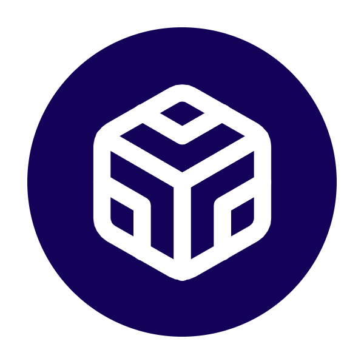
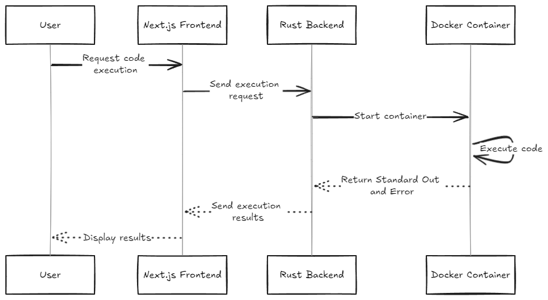

# Sandcode

Sandcode is a web-based code execution environment that allows users to write and run code in multiple programming languages. It consists of a Next.js frontend and a Rust backend server.



## Project Structure

```bash
.
├── apps
│   ├── client (Next.js frontend)
│   └── server (Rust backend)
└── docker
    └── Dockerfile (Sandbox for CodeExecution)
```

## Features

- Support for multiple programming languages (Python, Rust, C++, TypeScript, JavaScript)
- Real-time code execution
- Monaco Editor for enhanced code editing experience
- Input support for interactive programs
- Code download and copy functionality

## Execution Flow

Here's a visual representation of the execution flow in Sandcode:



## Getting Started

### Prerequisites

- Bun (v1.2.27 or higher)
- Rust (latest stable version)
- Docker (for sandboxing)

### Running the Client

1. Navigate to the client directory:

   ```bash
   cd apps/client
   ```

2. Install dependencies:

   ```bash
   bun install
   ```

3. Start the development server:

   ```bash
   bun dev
   ```

   The client will be available at `http://localhost:3000`.

### Running the Server

1. Navigate to the server directory:

   ```bash
   cd apps/server
   ```

2. Build and run the Rust server:

   ```bash
   cargo run
   ```

   The server will start on `http://localhost:8000`.

## Running the Execution Container

To run the server we need this image on the local system:

1. Build the Docker image:

   ```bash
   docker build -t executor -f docker/Dockerfile .
   ```

## Contributing

Contributions are welcome! Please feel free to submit a Pull Request.
